# 🧠 BrainBrawler - Guida Completa UX Experience

## Panoramica
BrainBrawler è una piattaforma quiz multigiocatore freemium che offre esperienze diverse per utenti FREE e PREMIUM, con monetizzazione tramite pubblicità e funzionalità premium.

---

## 📱 Flusso Utente

```mermaid
graph TD
    A[Landing Page] --> B{Account Utente?}
    B -->|Nuovo Utente| C[Registrazione]
    B -->|Utente Esistente| D[Login]
    C --> E[Verifica Email]
    D --> F{Email Verificata?}
    F -->|No| E
    F -->|Sì| G[Setup Account]
    E --> G
    G --> H{Tipo Account?}
    H -->|FREE| I[Lobby con Pubblicità]
    H -->|PREMIUM/ADMIN| J[Lobby Senza Pubblicità]
    I --> K[Selezione Gioco]
    J --> K
    K --> L[Waiting Room]
    L --> M[Gameplay]
    M --> N[Risultati & Statistiche]
    N --> O{Continua?}
    O -->|Sì| K
    O -->|No| P[Logout]
```



---

## 🎯 Journey Esperienza Utente

### 1. **Landing Page** (`index.html`)
**Scopo**: Prima impressione, acquisizione utenti, conversione

**Funzionalità**:
- Design moderno con gradiente e tema brain
- Form dual login/registrazione con tab switching
- Validazione real-time con controlli di disponibilità debounced
- Integrazione Google OAuth
- Password strength meter
- Design responsive per tutti i dispositivi

**FREE vs PREMIUM**: Nessuna differenza in questa fase

### 2. **Processo di Registrazione**
**Scopo**: Acquisire nuovi utenti con onboarding fluido

**Flusso**:
1. **Validazione Form**: Disponibilità username/email real-time
2. **Creazione Account**: Dati utente salvati nel database
3. **Verifica Email**: Codice a 6 cifre inviato via SMTP
4. **Email di Benvenuto**: Informazioni tipo account e funzionalità

**Tecnico**: 
- Chiamate API debounced per prevenire spam
- Validazione client-side e server-side
- Hash sicuro password (bcrypt)
- Storage: `localStorage.getItem('brainbrawler_user')` e `'brainbrawler_token'`

### 3. **Verifica Email** (`verify-email.html`)
**Scopo**: Garantire indirizzi email validi, ridurre spam

**Funzionalità**:
- Input codice 6 cifre con supporto paste
- Funzionalità resend con cooldown 60 secondi
- Auto-focus e navigazione input
- Animazioni di successo
- Gestione errori e retry logic

**Sicurezza**: Codici scadono dopo 24 ore

### 4. **Setup Account** (`account-setup.html`)
**Scopo**: Introdurre modello freemium, catturare upgrade intent

**Funzionalità**:
- Confronto side-by-side piani
- Value proposition chiara per ogni tier
- Loading states e transizioni fluide
- Layout grid responsive per mobile

**Piani**:
- **FREE**: Partecipa ai giochi, stats base, classifiche globali
- **PREMIUM**: $4.99 una tantum, crea stanze, domande custom, no ads

---

## 🎮 Esperienza Gameplay Core

### 5. **Lobby** (`lobby.html`)
**Scopo**: Hub centrale per gestione giochi e engagement utenti

#### **Esperienza Utente FREE**:
- **Banner Ad Top**: Google AdSense banner 728x90
- **Native Ad**: AdMob native ad in sidebar
- **Limitazioni Funzionalità**: Solo join giochi, no creazione
- **Prompt Upgrade**: Card pricing premium con benefici
- **Disclaimer Pubblicità**: "Gli annunci mantengono BrainBrawler gratuito"

#### **Esperienza Utente PREMIUM**:
- **Interfaccia Senza Ads**: Nessuna pubblicità mostrata
- **Notice Premium**: Conferma "esperienza senza pubblicità"
- **Funzionalità Complete**: Crea stanze, gestisci domande, stats dettagliate
- **Support Prioritario**: Esperienza utente potenziata

**Funzionalità Condivise**:
- Elenco stanze live con aggiornamenti ogni 5 secondi
- Funzionalità quick match
- Profilo utente con stats e achievements
- Badge tipo account (FREE/PREMIUM/ADMIN)

### 6. **Gestione Domande** (`manage-questions.html`)
**Scopo**: Funzionalità premium per creare e organizzare domande custom

#### **Sistema Question Sets**:
- **Organizzazione**: Domande raggruppate in set (10-1000 domande per set)
- **Supporto Multi-lingua**: IT 🇮🇹, EN 🇺🇸, ES 🇪🇸, DE 🇩🇪, FR 🇫🇷
- **Categorie Custom**: Utenti possono creare nuove categorie o selezionare esistenti
- **Upload Bulk**: Import file JSON con formato AI-compatibile
- **Tools di Gestione**: Crea, modifica, elimina domande e set

#### **Funzionalità**:
- **Tab Question Sets**: Panoramica di tutte le collezioni domande utente
- **Browser Domande**: Lista ricercabile con filtri (lingua, set, categoria, difficoltà)
- **Creator Singola Domanda**: Form con validazione e preview
- **Upload Bulk**: Drag-and-drop import JSON con download template
- **Filtri Real-time**: Ricerca istantanea e filtro su tutto il contenuto

#### **Formato Import JSON**:
```json
{
  "questionSet": {
    "name": "Quiz Conoscenza Generale",
    "description": "Un quiz completo che copre vari argomenti",
    "language": "IT",
    "category": "Generale"
  },
  "questions": [
    {
      "text": "Qual è la capitale della Francia?",
      "options": ["Londra", "Berlino", "Parigi", "Madrid"],
      "correctAnswer": 2,
      "difficulty": "EASY",
      "category": "Geografia", 
      "explanation": "Parigi è stata la capitale della Francia dal 987 d.C."
    }
  ]
}
```

### 7. **Creazione Stanza** (`create-room.html`)
**Scopo**: Funzionalità premium per creare stanze quiz custom

#### **Configurazione Stanza**:
- **Selezione Lingua**: La lingua della stanza determina i question set disponibili
- **Validazione Live**: Controllo disponibilità nome stanza real-time
- **Limiti Giocatori**: Massimo 2-10 giocatori
- **Opzioni Timing**: 5, 10, 15, o 20 secondi per domanda
- **Conteggio Domande**: 5, 10, 25, o 100 domande per gioco
- **Selezione Question Set**: Solo i question set dell'utente disponibili
- **Opzioni Privacy**: Stanze pubbliche o private protette da password

#### **Funzionalità Smart**:
- **Filtro Lingua**: Question set filtrati per lingua stanza selezionata
- **Check Disponibilità**: Previene nomi stanza duplicati con feedback visuale
- **Preview Question Set**: Mostra dettagli set, conteggio domande e categoria
- **Validazione Form**: Controlli completi prima creazione stanza
- **Isolamento Utente**: Ogni utente premium vede solo i propri question set

### 8. **Waiting Room** (`waiting-room.html`)
**Scopo**: Lobby pre-gioco per partecipanti

#### **Funzionalità Implementate**:
- **Informazioni Stanza**: Nome, lingua, categoria, timing, totale domande
- **Griglia Giocatori**: Visualizzazione giocatori connessi con avatar
- **Ruolo Creator**: Distintivo speciale per creatore stanza
- **Controlli Gioco**: Start gioco (solo creator), lascia stanza
- **Stato Real-time**: Aggiornamenti live dei giocatori che si uniscono/lasciano
- **Gestione Password**: Per stanze private

#### **Esperienza FREE vs PREMIUM**:
- **FREE**: Può solo unirsi a stanze esistenti
- **PREMIUM**: Può creare e gestire stanze, controllo completo parametri

### 9. **Gameplay** (`game.html`)
**Scopo**: Esperienza quiz core con competizione real-time

#### **Meccaniche di Gioco**:
- **Display Domande**: Tempo configurabile (5, 10, 15, o 20 secondi per domanda)
- **Selezione Risposte**: Scelta multipla (A, B, C, D)
- **Sistema Punteggio**: Punti basati su velocità e accuratezza
- **Aggiornamenti Real-time**: Classifica live durante il gioco
- **Supporto Multi-lingua**: Domande nella lingua selezionata stanza
- **Lunghezza Flessibile**: 5, 10, 25, o 100 domande per gioco

#### **Esperienza Utente FREE**:
- **Banner Ads**: Annunci sotto ogni domanda
- **Question Set Standard**: Solo categorie curate
- **Analytics Base**: Solo punteggio e posizione
- **Ad Break**: Pubblicità 3 secondi prima risultati finali
- **Solo Join**: Può unirsi a stanze ma non crearle

#### **Esperienza Utente PREMIUM**:
- **Gameplay Ininterrotto**: Nessuna pubblicità durante il gioco
- **Domande Custom**: Accesso ai question set caricati dall'utente
- **Creazione Stanze**: Controllo completo parametri gioco
- **Stanze Private**: Giochi protetti da password con amici
- **Analytics Dettagliate**: Tempi di risposta, trend accuratezza
- **Contenuto Multi-lingua**: Crea e gioca in lingue multiple

### 10. **Statistiche Avanzate** (`advanced-stats.html`)
**Scopo**: Funzionalità premium per analytics dettagliate performance

#### **Funzionalità Implementate**:
- **Dashboard Overview**: Cards con metriche chiave (giochi totali, vittorie, accuratezza media)
- **Grafici Interattivi**: Chart.js per visualizzazione dati nel tempo
- **Analisi Performance**: Breakdown per categoria, difficoltà, lingua
- **Filtri Temporali**: Visualizzazione dati per settimana, mese, anno
- **Leaderboard**: Posizione vs altri giocatori premium
- **Export Dati**: Funzionalità per esportare statistiche

#### **Metriche Trackate**:
- **Performance nel Tempo**: Trend accuratezza e punteggi
- **Analisi per Categoria**: Performance su diverse tipologie domande
- **Tempi di Risposta**: Velocità media per difficoltà
- **Question Set Performance**: Analytics sui set domande custom
- **Confronti**: vs media globale e amici

---

## 💰 Strategia Monetizzazione

### **Implementazione Pubblicità**

#### **Integrazione Google AdSense**:
```html
<!-- Banner Ads (utenti FREE) -->
<script async src="https://pagead2.googlesyndication.com/pagead/js/adsbygoogle.js"></script>
<ins class="adsbygoogle"
     style="display:block"
     data-ad-client="ca-pub-XXXXXXXXXX"
     data-ad-slot="XXXXXXXXXX"
     data-ad-format="auto"></ins>
```

#### **Strategia Posizionamento Ad**:
1. **Lobby**: Banner top (728x90) + Native ad sidebar
2. **Gameplay**: Banner sotto ogni domanda
3. **Risultati**: Interstitial fullscreen prima stats con countdown 3 secondi

### **Strategia Conversione Premium**

#### **Value Proposition**:
- **Rimozione Ad**: Motivazione primaria per utenti casual
- **Tools Creativi**: Creazione stanze per utenti coinvolti
- **Funzionalità Sociali**: Stanze private per gruppi amici
- **Pagamento Una Tantum**: No subscription fatigue

#### **Touchpoint Conversione**:
1. **Account Setup**: Selezione piano iniziale
2. **Lobby Upgrade Card**: Sempre visibile per utenti FREE
3. **Feature Blocks**: Quando prova a creare stanza
4. **Post-Ad Experience**: Prompt "Stanco delle pubblicità?"
5. **Momenti Sociali**: "Crea stanza privata per amici"

---

## 🎨 Principi Design

### **Gerarchia Visiva**:
- **Tema Brain**: Iconografia 🧠 consistente
- **Gradiente Purple**: Colori brand primari (#667eea to #764ba2)
- **Tipografia Pulita**: Font family Inter per leggibilità
- **Glassmorphism**: Effetti backdrop blur sottili

### **Accessibilità**:
- **Contrasto Colori**: Compliance WCAG 2.1 AA
- **Navigazione Tastiera**: Supporto tab completo
- **Screen Reader**: HTML semantico e label ARIA
- **Mobile First**: Filosofia design responsive

---

## 📊 Analytics & Metriche

### **Metriche Engagement Utenti**:
- **DAU/MAU**: Utenti attivi giornalieri e mensili
- **Durata Sessione**: Tempo speso nell'app
- **Giochi per Sessione**: Profondità engagement
- **Tassi Retention**: 1-giorno, 7-giorni, 30-giorni

### **Metriche Monetizzazione**:
- **Revenue per User Ad**: Monetizzazione utenti FREE
- **Tasso Conversione**: Upgrade FREE a PREMIUM
- **ARPU**: Revenue medio per utente
- **Churn Rate**: Analisi abbandono utenti

---

## 🚀 Architettura Tecnica

### **Stack Frontend**:
- **Vanilla JavaScript**: Leggero, caricamento veloce
- **Progressive Web App**: Esperienza mobile app
- **WebSocket Client**: Comunicazione real-time
- **Service Workers**: Funzionalità offline

### **Stack Backend**:
- **Node.js/Express**: Server API RESTful
- **Socket.io**: Comunicazione gioco real-time
- **PostgreSQL**: Dati utente e stato gioco
- **Prisma ORM**: Database management

### **Schema Database**:
- **User**: Account con `accountType` (FREE/PREMIUM/ADMIN)
- **QuestionSet**: Collezioni domande con `userId` per isolamento
- **Game**: Stanze con `createdBy`, `questionSetId`, supporto multi-lingua
- **GamePlayer**: Gestione partecipanti stanze
- **Question**: Domande con supporto multi-lingua e spiegazioni

### **Autenticazione**:
- **JWT Tokens**: Stored in `localStorage` come `'brainbrawler_token'`
- **User Data**: Stored come `'brainbrawler_user'` (non `'user'`)
- **Premium Verification**: Controllo `accountType` per accesso funzionalità

---

## 🔧 Funzionalità Implementate

### **Sistema Utenti**:
- ✅ Registrazione/Login con validazione real-time
- ✅ Verifica email con codici 6 cifre
- ✅ Setup account freemium
- ✅ Google OAuth integration
- ✅ Sistema di livelli e XP

### **Funzionalità Premium**:
- ✅ Creazione stanze custom con configurazioni avanzate
- ✅ Gestione question set multi-lingua
- ✅ Upload bulk domande formato JSON
- ✅ Statistiche avanzate con Chart.js
- ✅ Esperienza senza pubblicità

### **Sistema Gioco**:
- ✅ Lobby con elenco stanze live
- ✅ Waiting room pre-gioco
- ✅ Sistema real-time con Socket.io
- ✅ Supporto stanze private con password
- ✅ Multi-lingua (IT, EN, ES, DE, FR)

### **Monetizzazione**:
- ✅ Integrazione Google AdSense per utenti FREE
- ✅ Sistema upgrade premium $4.99 una tantum
- ✅ Feature gating per funzionalità premium
- ✅ UI differenziata FREE vs PREMIUM

---

## 📝 Metriche Successo

### **KPI Esperienza Utente**:
- **Time to First Game**: < 2 minuti dalla registrazione
- **Tasso Completamento Gioco**: > 85%
- **Soddisfazione Utente**: > 4.5/5 rating
- **Tempo Risposta Support**: < 24 ore

### **KPI Business**:
- **Monthly Recurring Revenue**: Da upgrade premium
- **Costo per Acquisizione**: Efficienza marketing
- **Lifetime Value**: Valore utente long-term
- **Market Share**: Posizionamento competitivo

---

*Questo documento serve come guida completa per l'implementazione del design UX e modello business di BrainBrawler.*